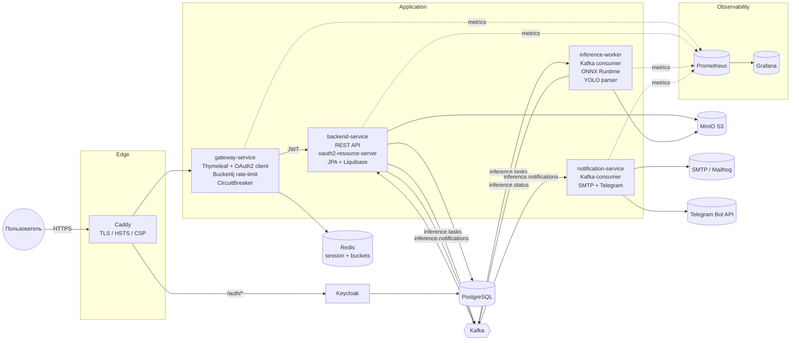
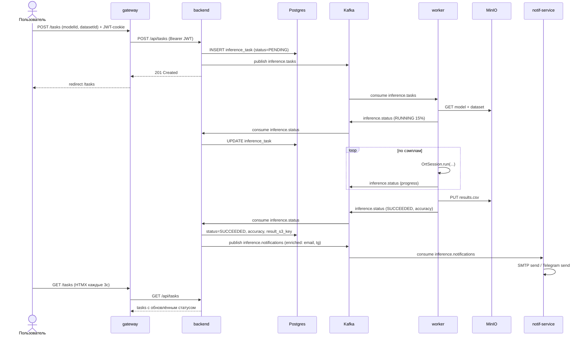
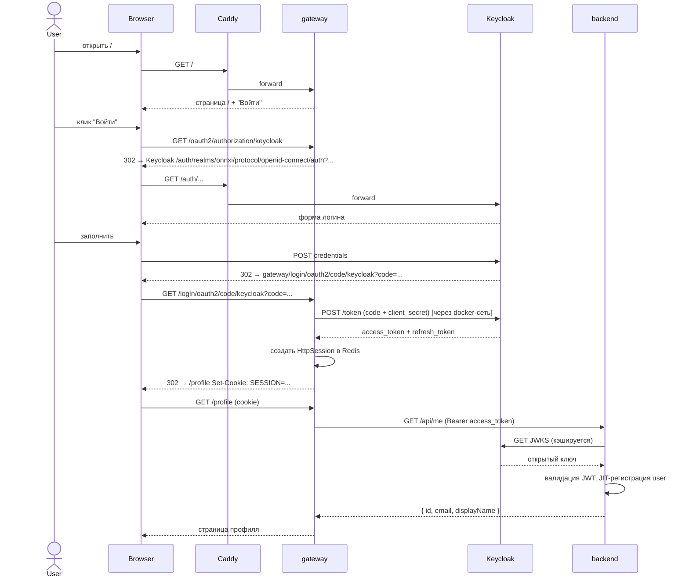
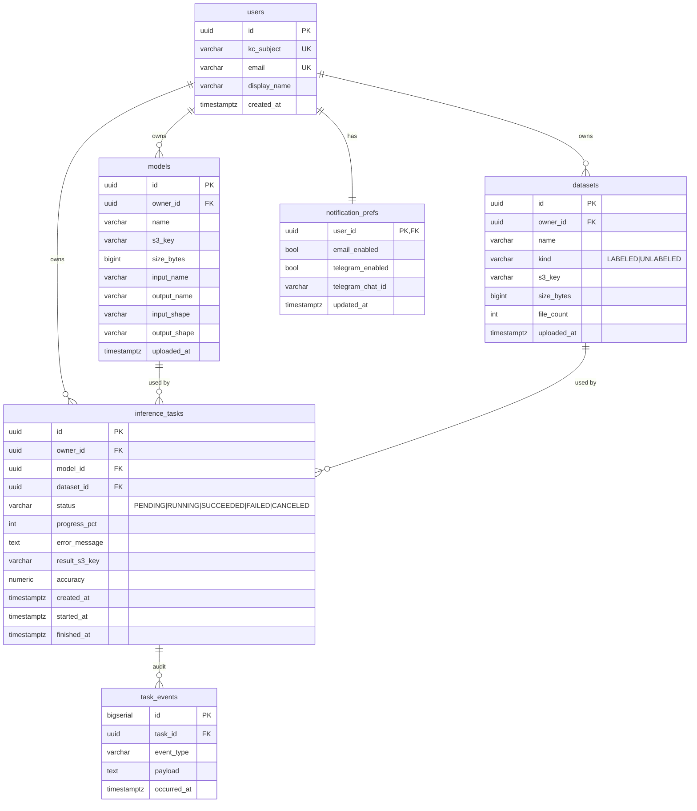

# Архитектура ONNXI

## Общая схема

## Сервисы

| Сервис | Порт | Ответственность |
|---|---|---|
| `gateway-service` | 8080 | BFF (Thymeleaf UI), OIDC-клиент Keycloak, проксирование вызовов в backend с прокидыванием JWT и `X-Correlation-Id`, Bucket4j rate-limit, Resilience4j CircuitBreaker. |
| `backend-service` | 8081 | REST API (`/api/models`, `/api/datasets`, `/api/tasks`, `/api/me/notifications`). Resource server, валидация JWT по JWKS Keycloak. JPA + Liquibase в Postgres, заливка артефактов в MinIO, продюсер/консьюмер Kafka. |
| `inference-worker` | 8082 | Слушает `inference.tasks`. Скачивает модель + датасет из MinIO, открывает `OrtSession`, гонит инференс. Поддержка classification (raw float32) и YOLO (image input, NMS, detect/pose, e2e). Считает recall + PCK@5px. Публикует прогресс/итог в `inference.status`. Retry + DLQ через Resilience4j. |
| `notification-service` | 8083 | Слушает `inference.notifications` — обогащённые события от backend (с email/chat_id). Шлёт SMTP и Telegram. |

## Поток постановки и обработки задачи

## Поток аутентификации

## База данных

## Kafka топики

| Топик | Producer | Consumer | Назначение |
|---|---|---|---|
| `inference.tasks` | backend | worker | Постановка задачи на обработку. |
| `inference.status` | worker | backend | Прогресс и финальный статус. |
| `inference.notifications` | backend | notification-service | Обогащённое событие с контактами пользователя. |
| `inference.tasks.DLQ` | worker (через `DeadLetterPublishingRecoverer`) | (ручной осмотр) | Сообщения, упавшие N раз с ExponentialBackOff. |

Спецификация сообщений — в `shared-dto/` (`InferenceTaskMessage`, `InferenceStatusMessage`,
`NotificationEvent`).

## Отказоустойчивость

| Точка отказа | Защита |
|---|---|
| backend HTTP временно недоступен (gateway → backend) | Resilience4j CircuitBreaker (sliding window 20, opens at 50% failures or 80% slow @ 4s); read-методы имеют fallback с пустыми списками. |
| Kafka consumer крашится | `DefaultErrorHandler` с `ExponentialBackOff` (2s → 30s, max 2 мин) → DLQ. |
| Inference падает на сэмпле | TaskConsumer ловит исключение, публикует `FAILED` в `inference.status`, пробрасывает выше → попадает в retry. |
| MinIO недоступен | Backend отдаёт 502 через `ApiExceptionHandler.storageError`. |
| Keycloak недоступен | Spring Security кеширует JWKS; задачи продолжают обрабатываться. |
| Слишком много запросов | Bucket4j-Redis rate-limit 60/min/user → 429 Too Many Requests. |

## Observability

- **Метрики**: каждый сервис отдаёт `/actuator/prometheus`. Custom-метрики:
  - `inference_tasks_total{status}` — backend counter
  - `inference_duration_seconds{outcome}` — worker timer
  - JVM / HTTP / Kafka / R4J автоматом
- **Логи**: `logback-spring.xml` в profile `docker|prod` → JSON через
  `logstash-logback-encoder` с полями `service`, `correlationId`.
- **Trace correlation**: `CorrelationIdFilter` в gateway и backend; gateway пробрасывает
  `X-Correlation-Id` в backend через `RestClient.requestInterceptor`. В логах все 4
  сервиса показывают один и тот же id.
- **Dashboard**: `infra/grafana/dashboards/onnxi-overview.json` — 4 панели (tasks rate,
  p95 duration, JVM heap, HTTP rps по статусам).
